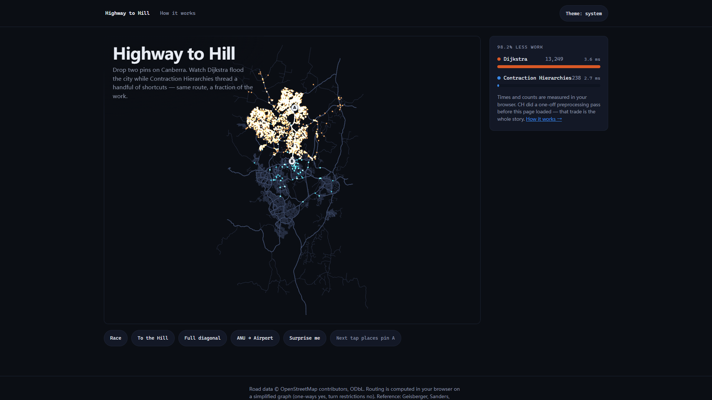

# Process overview

## What I built

*Highway to Hill* — an interactive explainer of Contraction Hierarchies that
races CH against Dijkstra (and, once you switch them on, A\* variants and
bidirectional forms) on Canberra's real OSM road network. Page one makes
you feel the speedup: drop two pins, watch the flood versus the sparks, read
numbers measured in your own browser. Page two explains where the speed
comes from with five toys that run the same algorithm code as the race.

## How it was built

1. **Brief → spec → build, in that order.** Nothing was coded from the
   brief directly. First a design doc and an annotated mockup shipped as a
   real page ([`9ad58dc`](https://github.com/comp4020-agentic-coding-studio/comp4020-ass1-rangermix/commit/9ad58dc));
   that commit also carries the project's first standing rule — my
   hand-picked palette failed the dataviz validator (rose↔violet ΔE 13.1),
   so validated hues plus a "don't invent hues" rule went into `CLAUDE.md`
   where later sessions can't unlearn them. After my design review the
   spec's checkable lines became a roster of todo contract tests and a
   13-task plan ([`388ce4a`](https://github.com/comp4020-agentic-coding-studio/comp4020-ass1-rangermix/commit/388ce4a)),
   and the build executed it task by task — fresh implementer subagent plus
   an independent reviewer per task, each todo test flipped live by the task
   named on it ([`5373bcc...524dcfe`](https://github.com/comp4020-agentic-coding-studio/comp4020-ass1-rangermix/compare/5373bcc...524dcfe)).
   The reviewer gate earned its cost early: chain contraction passed 43
   fixture tests, then crashed on the real extract (470 unbranched
   roundabouts produce self-loop edges no fixture modelled); the fix was
   red-green verified and independently re-reproduced before the task
   closed ([`d82d677...60fae72`](https://github.com/comp4020-agentic-coding-studio/comp4020-ass1-rangermix/compare/d82d677...60fae72)).

2. **The feedback → spec → implementation loop.** Every time I reviewed
   the live build, my feedback became binding spec amendments (§14–§21)
   with contract tests *before* any code changed, then went through the
   same task/review loop — seven rounds of it
   ([`b078bfd...907a18b`](https://github.com/comp4020-agentic-coding-studio/comp4020-ass1-rangermix/compare/b078bfd...907a18b)).
   The loop kept catching what neither I nor the agent would have caught
   alone: a "footer out of style" complaint root-caused to a curly-quote
   `class=”site-foot”` typo a fix wave had shipped; my "greedy A\* looks
   bugged in bidirectional mode" became a written hypothesis in the spec
   *before* any fix (h-only keys void the balanced termination bound),
   confirmed by measurement — the search settled ~101% of the entire graph
   — and was honestly redefined rather than papered over; and the round
   that turned the confusing shortcut/ordering chapters into narrated,
   replayable algorithms had its review catch the display printing
   "67s > 67s" on rounded ties before it ever shipped. The same loop ran
   against the site's own numbers: an inadmissible A\* ceiling found by
   review became a data-derived ceiling guarded by a test that re-scans
   every edge — less dramatic, and correct
   ([`2b41314...07120d9`](https://github.com/comp4020-agentic-coding-studio/comp4020-ass1-rangermix/compare/2b41314...07120d9)).

3. **Teaching the agent to parallelise.** Mid-project I gave a standing
   instruction: always split the work across concurrent subagents. The
   first attempt used git worktrees — visible in the history as worktree
   merges ([`c5e1a85`](https://github.com/comp4020-agentic-coding-studio/comp4020-ass1-rangermix/commit/c5e1a85))
   — and it bit twice: agents forked from a stale root commit, and the
   shared test sweep started running sibling worktrees' suites
   ([`145d750`](https://github.com/comp4020-agentic-coding-studio/comp4020-ass1-rangermix/commit/145d750)).
   So I redirected it: no worktrees — parallelise foreseeably
   conflict-free work in ONE checkout instead. The settled pattern, written
   into every plan since the roster round
   ([`8677722`](https://github.com/comp4020-agentic-coding-studio/comp4020-ass1-rangermix/commit/8677722)):
   strict per-task file partitions, own-files-only staging, shared
   contracts pre-written by the controller before the wave (the racer
   roster, the curve-drawing helper), targeted tests inside the wave and
   one integrated roster run after it. The final round is the readable
   example: three implementer commits land as disjoint partitions of one
   checkout, then a gate commit folds all three reviews
   ([`e6ba778...907a18b`](https://github.com/comp4020-agentic-coding-studio/comp4020-ass1-rangermix/compare/e6ba778...907a18b)).

4. **Removing the clock.** The original spec planned scope tiers against
   the deadline (§11: MVP / target / stretch, "against the clock"). Once
   the MVP was deployed and green I inverted that with a second standing
   instruction: forget the deadline — never cut scope to fit time. The
   effect is visible wherever honest-but-slow beat quick-but-flattering:
   replay pacing is proportional to each algorithm's real measured time
   with no cap, because the long replays *are* the point
   ([`ee1c59a`](https://github.com/comp4020-agentic-coding-studio/comp4020-ass1-rangermix/commit/ee1c59a));
   and the seventh feedback round took the expensive option — a narrated
   per-decision rebuild of two chapters — over the cheap copy-polish that
   a deadline would have forced, landing after the original cutoff because
   the instruction was to finish the work, not the clock
   ([`e6ba778...907a18b`](https://github.com/comp4020-agentic-coding-studio/comp4020-ass1-rangermix/compare/e6ba778...907a18b)).

## Where to look

- `docs/superpowers/specs/2026-08-14-ch-explainer-design.md` — the living
  spec: base design plus §14–§21, one section per review round; its
  checkable lines live as tests in `spec/highway-to-hill.test.ts`.
- `docs/superpowers/plans/` — the base 13-task plan and one compact plan
  per feedback round; the round plans carry the parallel-wave structure
  (partitions, interfaces, controller pre-writes) described above.
- `docs/evidence/` — verification screenshots (both viewports, both
  themes, the race finals, the buried-map order replay, the narrated
  contraction).
- `docs/mockup/` — the pre-implementation annotated mockup, kept deployed.
